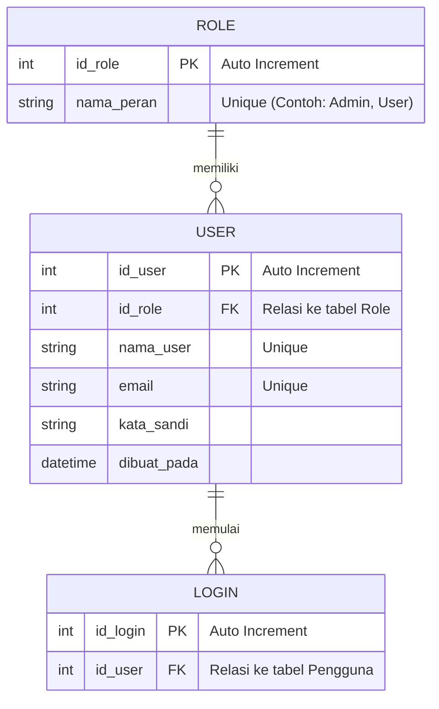

# Authentication Flow ERD

```mermaid
erDiagram
    ROLE ||--o{ USER : "memiliki"
    USER ||--o{ LOGIN : "memulai"

    USER {
        int id_user PK "Auto Increment"
        int id_role FK "Relasi ke tabel Role"
        string nama_user "Unique"
        string email "Unique"
        string kata_sandi 
        datetime dibuat_pada
    }
    
    ROLE {
        int id_role PK "Auto Increment"
        string nama_peran "Unique (Contoh: Admin, User)"
    }

    LOGIN {
        int id_login PK "Auto Increment"
        int id_user FK "Relasi ke tabel Pengguna"
    }

```
